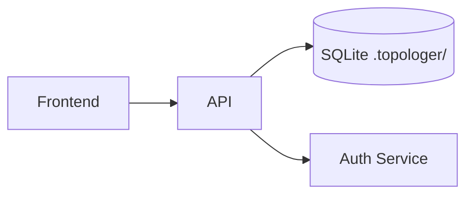
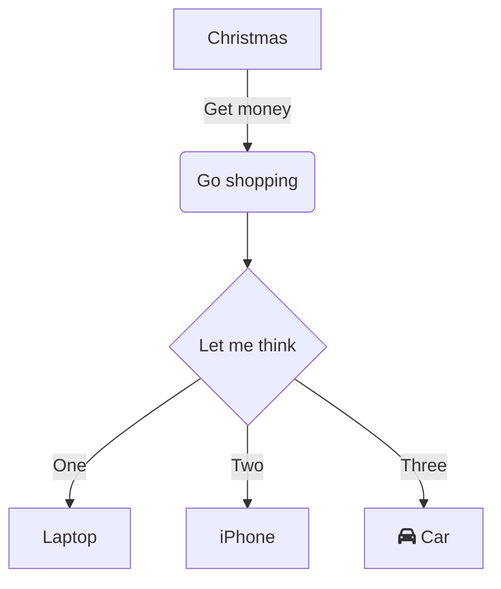
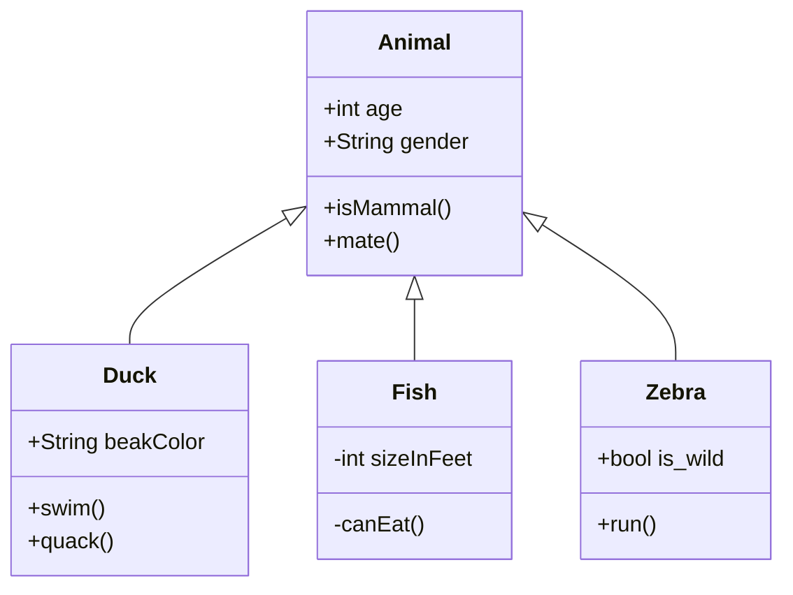
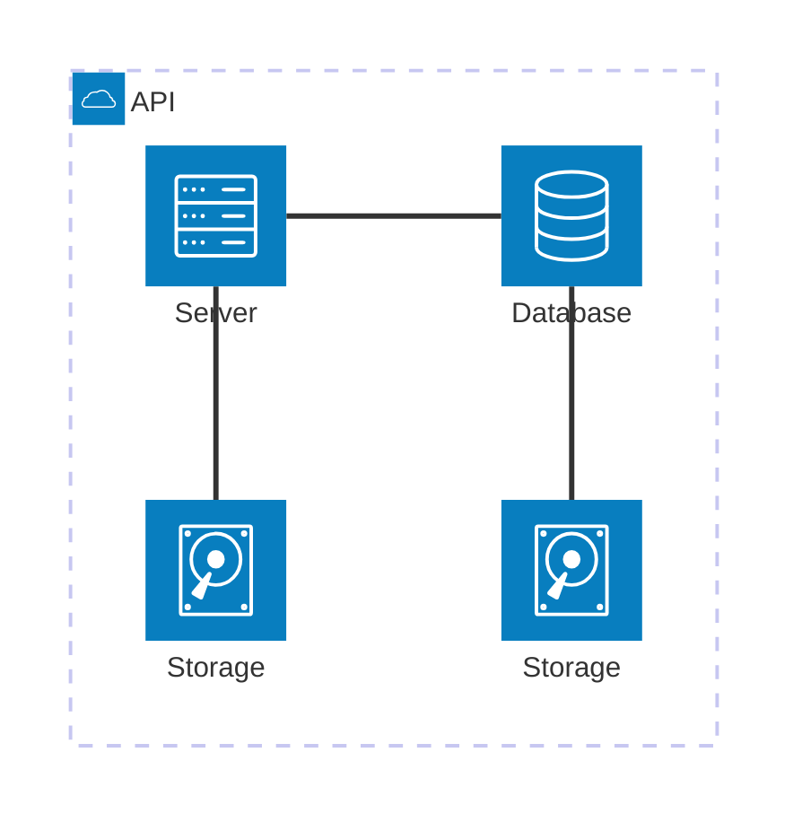
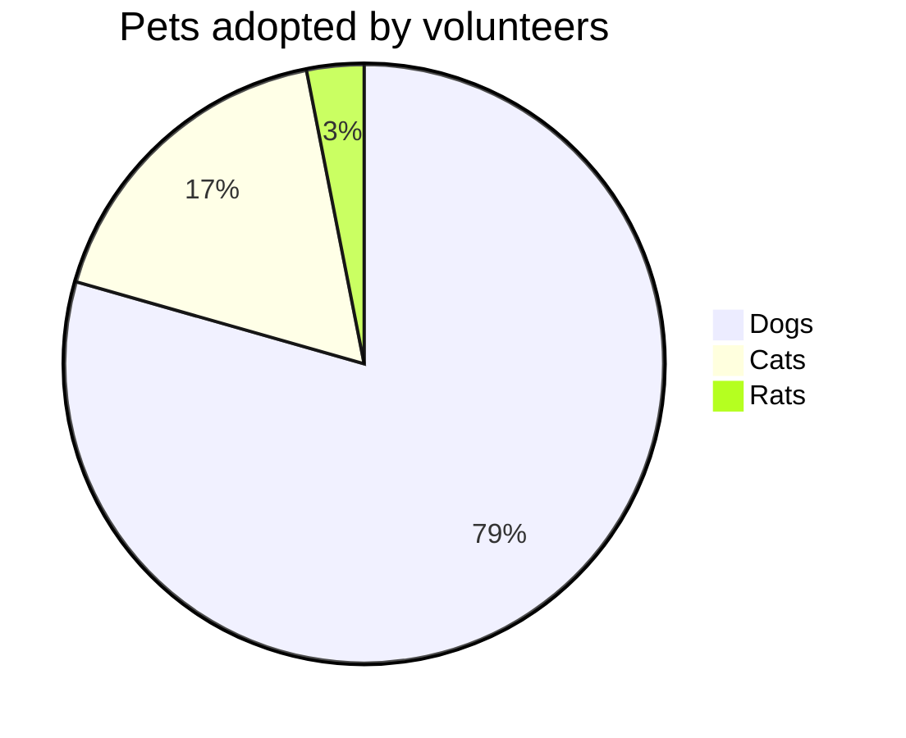
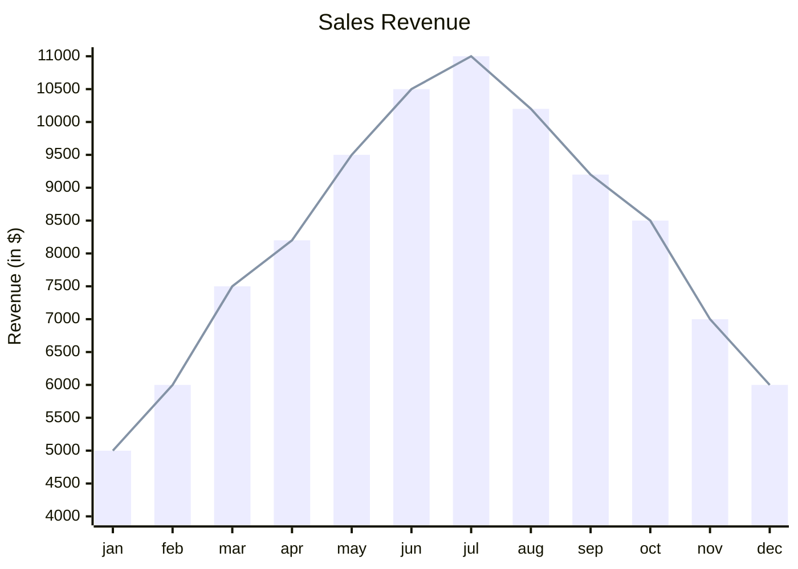

# Hello Mr.Wolf!
*- Have you got money?*
*- ...*
*- Nope!? So look this shit:*

To read this document install **Markdown Preview Enhanced**
To highlight js errors set **ESLint**
For React snippets take this shit: **Simple React Snippets**
 
Use **.continue** to bind inline chat.
 

# .K, let's`.go`!

Make references to another files [about.md](./about.md)!

Insert images!

Use [MERMAID](https://mermaid.live/edit#pako:eNqdVdFumzAU_ZUrP3USywg0oUXTpJCk1R4qdWv3MiFVBpzEKtiRbdZkVf59xkAgidNu4yWxOcfnHt9j84pSnhEUounllDNFNipmoB9FVU7gYSsVKaB5AxnFS4ELWHABX_WUYERBhNkzZcsGW7Pn1cu1oJI8RbxkGRbbi8R1IEYVup1yY_QBXmtG9dwTITm7SEupeEHEpMVXq0-bSZjEqJqfQAsDvgC1IpBopAMvVK1gbRbCuZkDnKZaUMmBljsrFlnFIgvlab5Re9rUSpvWNWZEpmaBs6ozK332tsXPifj05X2jnWjdmYv6Z2K29Vz3auE85y9yry5BcfhFyQtQpjtfYEU5A5zwUlVVUXGo7gBmGRT4mcAabwtiKcgaj-FxPI7S0TmZJaYH9WBe0e6wLk0nk1j9PCguiASc5-1GpnrCVF1BT13tnTs9V0pgJnFawfSIqPTYVVdgz5V37Mqz2DptUj8XzSGcHGTRSosstKgNk6zHf31agFVHPqeMDE6Ud2d8d20xB2P-scA0b5TrOh61NjXh04J3NBVc8oWC-SZdYbYkQPqUU-E2AI3KzGJ4BjOscIIl-V_nlr52DfWPG-rXMsn51HaFfytJSZrabyy134BBnC988EYIDLXXgluLwO17Av9wgzZBOPq7j0ZEv5O8f5n3758fksj9YjWye9072Ac4G8rk7IGwTDbRkc2Zv3u8txA1_ODzcsDU95ymIActBc1QqERJHKSR-qUeItPVGOmdKvQGhtUFj8VzjGK205w1Zj85L1qa4OVyhcIFzqUelesMKzKrP597iNbWX5BqZ1HojXyzBgpf0QaFl_5geBVcBkEwGgbjq7HnoC0K_ZE_8F3PHbvXnusOvWt_56DfRtUdXAUjVz_e2A0C1xt5uz8XHIBB) to visualize schemes!

## Flowchart 

## Class 

## Architecture 

## PIE CHART 

## XY Chart 

## Ahhah, still not enough!? Check this [out](https://www.markdownguide.org/basic-syntax/), man!